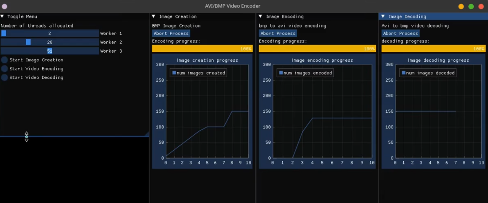

# Video Conversion Pipeline

A high-performance BMP ↔ AVI converter built on a multi-threaded pipeline architecture.

**Demo:** https://youtu.be/ld9ht4Y3uJQ



## Features

- **Parallel Encoding** — Multi-threaded workload with pthread synchronization
- **Shared Memory** — `mmap` and mutexes for high-speed frame buffering
- **Bi-directional** — BMP → AVI and AVI → BMP conversion
- **Real-time UI** — Live process monitoring and FPS display via ImGui

## Setup

This repo uses ImGui and ImPlot as submodules. After cloning, initialize them:

```bash
git submodule update --init --recursive
```

Install dependencies (run once):

```bash
make apt   # Ubuntu/Debian
make rpm   # Fedora
```

Then build:

```bash
make all
```

## Usage

```bash
make test
```